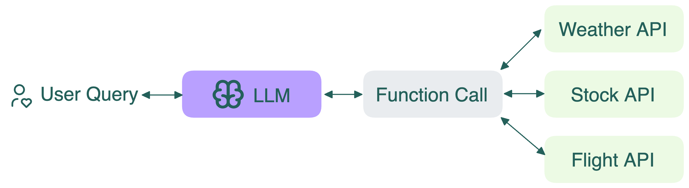

import LinkList from '@site/src/components/LinkList';

# Function calling

Function calling is like giving an LLM a toolbox with specific tools it can use to help you. When you ask the model to do something that requires one of these tools, it can "call" or use that tool to get the job done.

Here is a specific example:

- **You ask**: "What's the current price of Apple stock?"
- **LLM thinks**: "I need current stock data, so I'll use my stock price function"
- **LLM calls**: `get_stock_price("AAPL")`
- **Function returns**: "$195.25"
- **LLM responds**: "The current price of Apple stock is $195.25"

At a technical level, the LLM still predicts the next token, just like any other transformer-based models. The prompt includes well-defined function signatures and descriptions, guiding the model to produce outputs that match those formats. This allows you to build workflows like:

- Calling APIs from a user’s input
- Triggering actions (e.g., send email, retrieve weather)
- Passing outputs back into the model for multi-turn conversations

<LinkList>
  ## Additional resources
  * [Function Calling with Open-Source LLMs](https://bentoml.com/blog/function-calling-with-open-source-llms)
</LinkList>