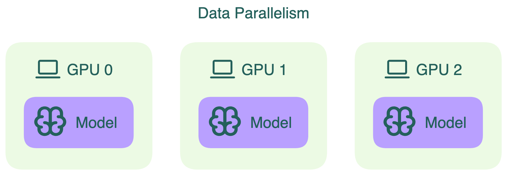
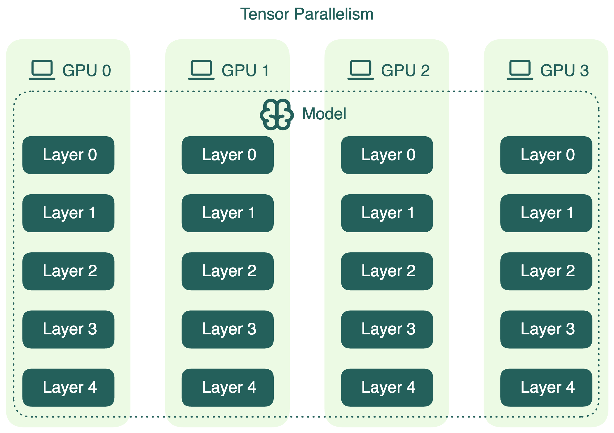
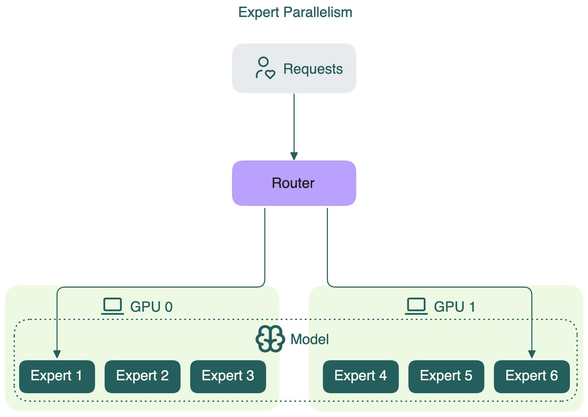

import LinkList from '@site/src/components/LinkList';

# Data, tensor, pipeline, expert and hybrid parallelisms

Parallelism strategies are essential for achieving high-performance computing in modern AI systems. They allow workloads to be distributed across multiple devices, maximizing cost efficiency and improving throughput. Many new parallelization strategies continue to emerge as models grow larger and more complex.

## Data parallelism

Data parallelism is a common technique to accelerate computation. In this approach, the model's weights are replicated across multiple GPU devices, and the global batch of input data is divided into smaller microbatches. Each device only processes the microbatch assigned to it and this process happens in parallel for all devices. This delivers faster execution by allowing larger batches to be processed simultaneously.

## Tensor parallelism

Tensor parallelism slices individual layers of the model into smaller blocks. These blocks are computed independently and in parallel across different devices. For example, during matrix multiplication, different slices of the matrix can be processed simultaneously on different GPUs.

This approach delivers faster computation and allows serving LLMs that do not fit into the memory of a single device. However, because it involves extra communication between devices, you need to balance the performance gain against this overhead.

## Pipeline parallelism

[Pipeline parallelism](https://arxiv.org/pdf/1811.06965) divides the model’s layers into sequential chunks, each assigned to a separate device. Data flows through these chunks like an assembly line, with the output of one device becoming the input for the next. For instance, in a four-way pipeline, each device processes a quarter of the model’s layers.

However, because each device depends on the output of the previous one, some devices may be idle at times, which means resource underutilization. To reduce these idle periods, the input batch can be split into smaller microbatches. Each microbatch flows through the pipeline one by one, and gradients are accumulated at the end. This microbatching improves GPU utilization, though it does not completely eliminate idle time.

Note that pipeline parallelism can increase the total latency for each request because of
communication between different pipeline stages.

## Expert parallelism

Expert parallelism is a specialized parallelism strategy used in Mixture of Experts (MoE) models. In these models, only a subset of the model’s experts is activated for each token. Instead of duplicating all experts across every device (e.g., GPU), expert parallelism splits the experts themselves across different devices.

Each GPU holds the full weights of only some experts, not all. This means that each GPU processes only the tokens assigned to the experts stored on that GPU. In contrast, if you apply tensor parallelism for MoE models, it simply slices the weight matrices of all experts and distributes these slices across all devices.

By using expert parallelism, GPUs can be utilized more efficiently. This reduces memory and compute overhead compared to replicating the entire model on every device.

## Hybrid parallelism

For certain models, relying on a single parallelism strategy is often not enough. Hybrid parallelism combines two or more parallelism techniques to achieve better scalability, efficiency, and hardware utilization.

A typical hybrid setup might look like this (combining data parallelism and tensor parallelism):

If you have 8 GPUs, you could apply tensor parallelism across the first four GPUs (TP=4), then replicate that setup to the remaining ones using data parallelism (DP=2).

Note that this is only one of the possible combinations, each with advantages and disadvantages. In the above example, tensor parallelism introduces communication overhead between GPUs, especially during inference. Therefore, using a high TP degree doesn't always translate to better performance.

An alternative configuration is to reduce tensor parallelism and increase data parallelism. For example, you can set TP=2 and DP=4:

This reduces cross-GPU communication, which may help lower latency during inference. However, there’s a catch: model weights consume a large portion of GPU memory, especially for large models. Lowering tensor parallelism means fewer GPUs share the model, leaving less room for KV cache. This can degrade inference optimizations like prefix caching.

These trade-offs aren’t unique to tensor and data parallelism. When designing a hybrid parallelism plan, it’s essential to benchmark different configurations based on your specific model size, hardware setup, and inference requirements. There’s no one-size-fits-all setup. The optimal strategy is often found through tuning and experimentation.

<LinkList>
  ## Additional resources
  * [Megatron-LM: Training Multi-Billion Parameter Language Models Using Model Parallelism](https://arxiv.org/pdf/1909.08053)
  * [GPipe: Easy Scaling with Micro-Batch Pipeline Parallelism](https://arxiv.org/pdf/1811.06965)
  * [DeepSpeed-MoE: Advancing Mixture-of-Experts Inference and Training to Power Next-Generation AI Scale](https://arxiv.org/abs/2201.05596)
</LinkList>