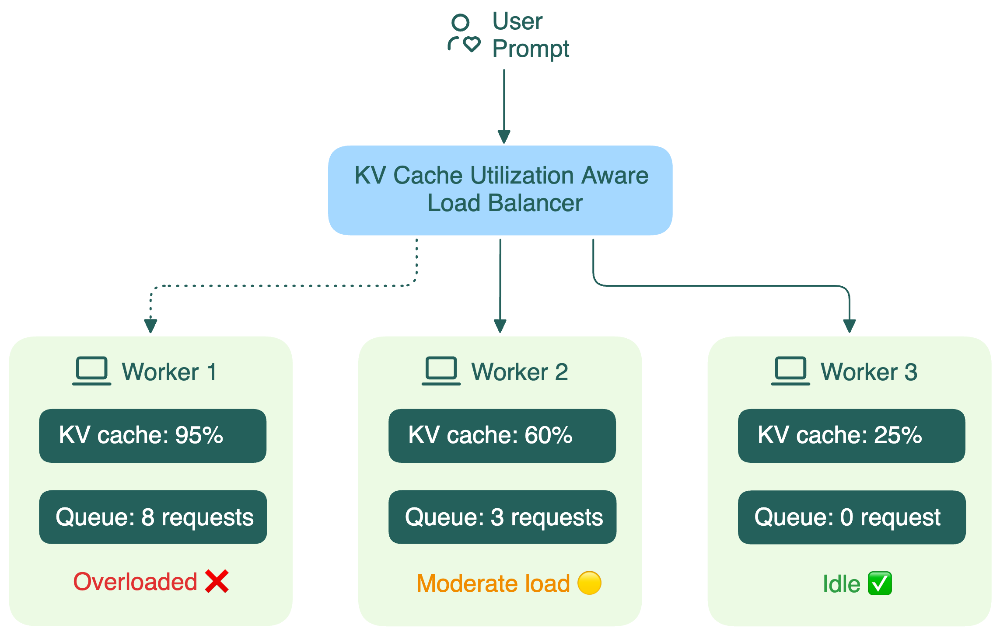

# KV cache utilization-aware load balancing

For traditional web applications, load balancing is usually pretty simple. Requests are small, responses are quick, and any backend instance can handle any request equally well. Load balancers can use simple strategies like round-robin to distribute traffic evenly.

But things are completely different for LLM inference. A major factor here is the KV cache built during the prefill phase.

Traditional load balancers treat LLM workers like identical black boxes. They don’t see what’s going on inside each worker, including:

- How much GPU memory is consumed by the KV cache
- How long the request queue is

When a load balancer can’t see these details, it starts making bad decisions, leading to:

- **Missed cache reuse**: New requests with similar prefixes can't leverage existing cached computations (more details in the next section).
- **Increased latency**: Conversations routed to wrong replicas lose their KV cache, requiring expensive re-computation.
- **Load imbalance**: Some workers process many long conversations while others remain idle.

The open-source community is already working on smarter solutions. For example, the [Gateway API Inference Extension](https://github.com/kubernetes-sigs/gateway-api-inference-extension) project uses an endpoint picker (EPP) to collect information on KV cache utilization, queue length, and LoRA adapters on each worker, and routes requests to the optimal replica for better inference.