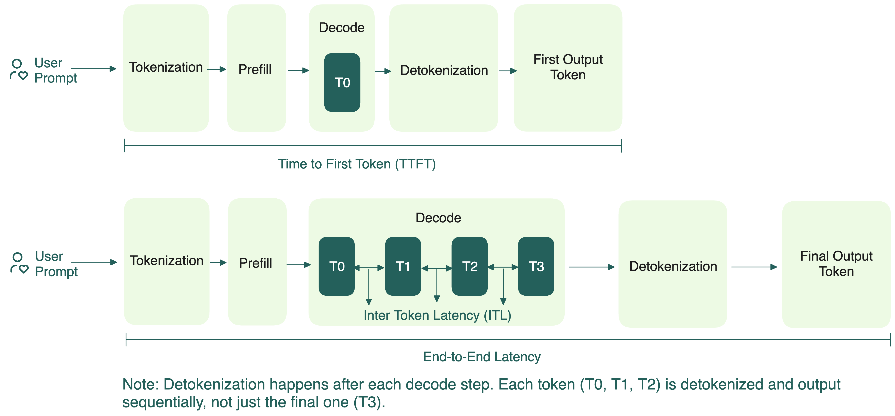
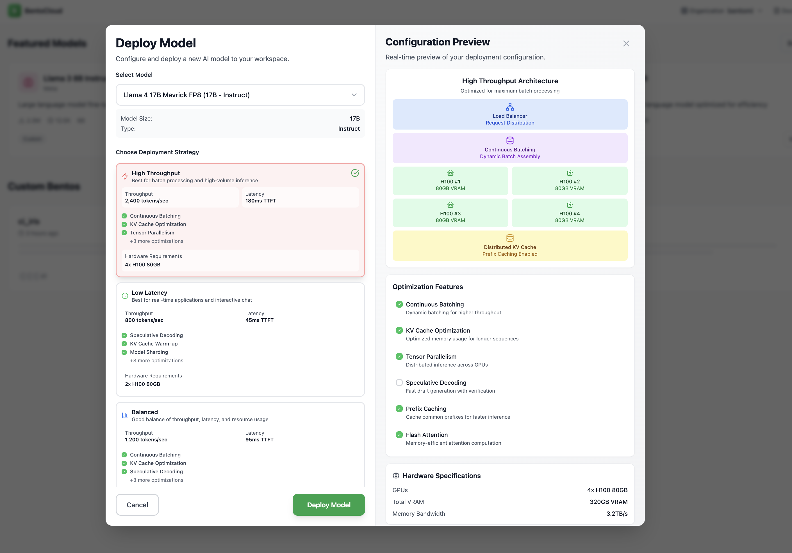

import LinkList from '@site/src/components/LinkList';
import Button from '@site/src/components/Button';

# Key metrics for LLM inference

Before exploring optimization techniques, let’s understand the key metrics they target. Evaluating LLM performance involves using various tools that define, measure, and calculate these metrics differently.

## Latency

Latency measures how quickly a model responds to a request. It’s crucial for user experience, especially in interactive, real-time applications.

Key metrics to measure latency:

- **Time to First Token (TTFT)**: The time it takes to generate the first token after sending a request. It reflects how fast the model can start responding.
- **Time per Output Token (TPOT)**: Also known as Inter-Token Latency (ITL), TPOT measures the time between generating each subsequent token. A lower TPOT means the model can produce tokens faster, leading to higher tokens per second.
    
  In streaming scenarios where users see text appear word-by-word (like ChatGPT's interface), TPOT determines how smooth the experience feels. The system should ideally keep up with or exceed human reading speed to ensure a smooth experience.

- **Token Generation Time**: The time between receiving the first and the final token. This measures how long it takes the model to stream out the full response.
- **Total Latency (E2EL)**: The time from sending the request to receiving the final token on the user end. Note that:
    
    ```bash
    Total Latency = TTFT + Token Generation Time
    ```
    
    Total latency directly affects perceived responsiveness. A fast TTFT followed by slow token generation still leads to a poor experience.


    
Acceptable latency depends on the use case. For example, a chatbot might require a TTFT under 500 milliseconds to feel responsive, while a code completion tool may need TTFT below 100 milliseconds for seamless developer experience. In contrast, if you're generating long reports that are reviewed once a day, then even a 30-second total latency may be perfectly acceptable. The key is to match latency targets to the pace and expectations of the task at hand.

### Understanding mean, median, and P99 latency

When analyzing LLM performance, especially latency, it’s not enough to look at just one number. Metrics like mean, median, and P99 each tell a different part of the story.

- **Mean (Average)**: This is the sum of all values divided by the number of values. Mean gives a general sense of average performance, but it can be skewed by extreme values (outliers). For example, if the TTFT of one request is unusually slow, it inflates the mean.
- **Median**: The middle value when all values are sorted. Median shows what a "typical" user experience. It’s more stable and resistant to outliers than the mean. If your median TTFT is 30 seconds, most users are seeing very slow first responses, which might be unacceptable for real-time use cases.
- **P99 (99th Percentile)**: The value below which 99% of requests fall. P99 reveals worst-case performance for the slowest 1% of requests. This is important when users expect consistency, or when your SLAs guarantee fast responses for 99% of cases. If your P99 TTFT is nearly 100 seconds, it suggests a small but significant portion of users face very long waits.

  :::note
  You may also see P90 or P95, which show the 90th and 95th percentile latencies, respectively. These are useful for understanding near-worst-case performance and are often used in cases where P99 may be too strict or sensitive to noise.
  :::

Together, these metrics give you a complete view:

- **Mean** helps monitor trends over time.
- **Median** reflects the experience of the majority of users.
- **P99** captures tail latency, which can make or break user experience in production.

You’ll often see these metrics in LLM performance benchmarks, such as mean TTFT, median TPOT, and P99 E2EL, to capture different aspects of latency and user experience.
    
## Throughput

Throughput describes how much work an LLM can do within a given period. High throughput is essential when serving many users simultaneously or processing large volumes of data.

There are two common ways to measure throughput:

- **Requests per Second (RPS)**: This metric captures how many requests the LLM can successfully complete in one second. It’s calculated as:
    
    ```bash
    Requests per second = Total completed requests / (T1 - T2)
    ```
    
    :::note

    Here, T1 and T2 mark the time window in seconds.

    :::
    
    RPS gives a general sense of how well the LLM handles concurrent requests. However, this metric alone doesn’t capture the complexity or size of each request. For example, generating a short greeting like `“Hi there!”` is far less demanding than writing a long essay.
    
    Factors that impact RPS:
    
    - Prompt complexity and length
    - Model size and hardware specifications
    - Optimizations (e.g., batching, caching, inference engines)
    - Latency per request
  
- **Tokens per Second (TPS)**: This metric provides a finer-grained view of throughput by measuring how many tokens are processed every second across all active requests. It comes in two forms:
    - **Input TPS**: How many input tokens the model processes per second.
    - **Output TPS**: How many output tokens the model generates per second.
    
    Understanding both metrics helps you identify performance bottlenecks based on the nature of your inference workload. For example:
    
    - A summarization request that includes long documents (e.g., 2,000-token inputs) cares more about input TPS.
    - A chatbot that generates long replies from short prompts (e.g., 20-token prompt → 500-token response) depends heavily on output TPS.
    
    When reviewing benchmarks or evaluating LLM performance, **always check whether TPS metrics refer to input, output, or a combined view**. They highlight different strengths and limitations depending on the use case.
    
    Factors that impact TPS:
    
    - Batch size (larger batches can increase TPS until saturation)
    - KV cache efficiency and memory usage
    - Prompt length and generation length
    - GPU memory bandwidth and compute utilization
    
    As the number of concurrent requests increases, the total TPS also grows, until the LLM hits the saturation point of available compute resources. Beyond this point, performance might decrease because the LLM is over capacity.

---

At Bento, we offer deployment and inference optimization strategies tailored to your use case. You can easily leverage them to optimize for throughput, latency, or cost.



<div style={{ margin: '3rem 0' }}>
[<Button>Talk to us</Button>](https://l.bentoml.com/contact-us-llm-inference-handbook)
</div>
    
## Goodput

Goodput refines the idea of throughput. It measures how many requests per second the LLM successfully completes while meeting your defined service-level objectives (SLOs). This makes it a much more useful metric for real-world deployments, as it directly reflects service quality.

:::info

A **Service-Level Objective (SLO)** defines the target performance level for a particular metric. It sets a standard for what’s considered acceptable service. For example, an SLO for TTFT might specify that 95% of chatbot interactions should have a TTFT below 200 milliseconds. An SLO is typically a key part of a broader service-level agreement (SLA) between a service provider and its users.

:::

Why does goodput matter? A high throughput doesn’t always mean good user experience. If latency targets aren’t met, many of those requests may not be usable. Goodput is a direct measure of how well an LLM serving system meets both performance and user-experience goals under latency constraints. It helps avoid the trap of maximizing throughput at the cost of real user experience and cost-efficiency.

## Latency vs. throughput tradeoffs

When hosting and optimizing LLM inference, there’s always a balance between two key goals: minimizing latency and maximizing throughput. Let’s break down what that means.

| Goal | Implication |
| --- | --- |
| Maximize throughput (TPS/MW) | Focus on serving as many tokens per watt as possible. This usually means using larger batch sizes and shared compute resources. However, it can slow down responses for individual users. |
| Minimize latency (TPS per user) | Focus on giving each user a fast response (low TTFT). This often involves small batches and isolated compute resources, but it means you’ll use GPUs less efficiently. |
| Balance of both | Some systems aim for a dynamic balance. They tune resource usage in real time based on workload, user priority, and app requirements. This is ideal for serving diverse applications with different SLOs. |

To reach the best trade-off for your use case, you’ll need to adjust several important system-level “knobs”, such as Data Parallelism (DP), Tensor Parallelism (TP), Expert Parallelism (EP), batch size, precision (e.g., FP8, FP4), and disaggregation (separating prefill and decode). These tuning options directly impact how well you can optimize for either low latency or high throughput, or find the right middle ground. More details will be covered in the next section.

Using a serverless API can abstract away these optimizations, leaving you with less control over fine-tuning. On the other hand, building your own programmable and low-level stack lets you navigate these tradeoffs and align your system performance with your app’s specific SLO.

<LinkList>
  ## Additional resources
  * [NVIDIA NIM LLMs Benchmarking - Metrics](https://docs.nvidia.com/nim/benchmarking/llm/latest/metrics.html)
  * [Mastering LLM Techniques: Inference Optimization](https://developer.nvidia.com/blog/mastering-llm-techniques-inference-optimization/)
  * [LLM-Inference-Bench: Inference Benchmarking of Large Language Models on AI Accelerators](https://arxiv.org/pdf/2411.00136)
  * [Throughput is Not All You Need](https://hao-ai-lab.github.io/blogs/distserve/)
</LinkList>