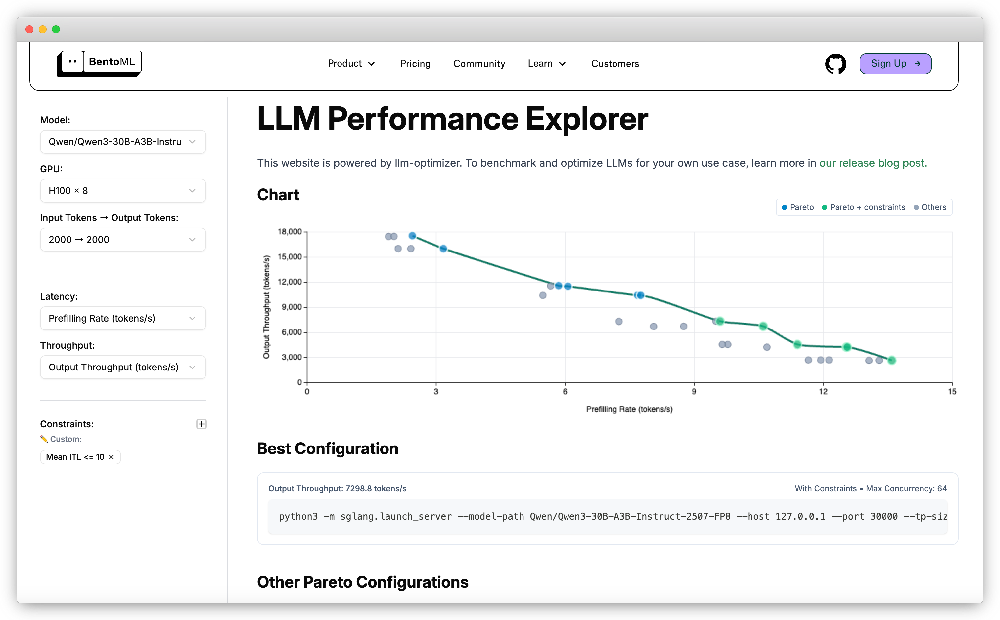

import LinkList from '@site/src/components/LinkList';

# LLM performance benchmarks

You’ve probably seen LLM leaderboards. Those neatly formatted ranking tables show the top LLMs based on various benchmarks. They can be a useful reference for understanding a model’s capabilities. They can also be misleading if you treat them as the only source to choosing the best LLM.

Benchmarking LLMs is a complex task. A high score on a public benchmark doesn’t guarantee the model will perform well for your workload. Your production setup will rarely match the environment used in someone else’s LLM ranking. This is especially true when you want to optimize for a certain scenario, like having an output throughput of 120 tokens/second while keeping end-to-end latency under 300 ms.

To obtain the optimal configuration for your use case, you need to run custom performance benchmarks for LLM inference. That means carefully designed tests and often trade-offs between throughput, latency, and cost.

## What are LLM benchmarks

When people talk about LLM benchmarks, they usually mean two different things:

- **Quality benchmarks**. Measure how well a model answers questions, reasons, or follows instructions. Examples include MMLU, GSM8K, HumanEval, and TruthfulQA. Quality benchmarks often drive the LLM leaderboards you see online ranking the best LLMs.
- **Performance benchmarks**. Measure how fast and efficiently a model runs in real-world environments. They focus on LLM performance metrics such as throughput (tokens per second), latency (Time to First Token, median, P99), cost efficiency, and GPU utilization.

Both types of benchmarks matter, but they serve very different purposes. A model that ranks highly on a quality leaderboard may still deliver poor results in production if latency is too high or costs are unsustainable. On the other hand, a model with excellent inference performance but weaker benchmark accuracy might still be the right choice for applications where speed is more important.

In this handbook, we focus more on performance benchmarks for LLM inference.

## When you should run performance benchmarks

Here are situations where custom benchmarking makes sense:

- **Comparing different models**. When you make a decision between two of the best LLMs, benchmarks reveal how they differ in throughput, latency, and cost under your workload.
- **Evaluating inference frameworks**. Frameworks like vLLM, SGLang, TensorRT-LLM, and Hugging Face TGI provide different inference optimizations. Benchmarks help you see which delivers the best trade-off for your setup.
- **Testing infrastructure changes**. Moving from A10G to H100 GPUs, or switching from on-prem to cloud, will affect performance. Benchmarks confirm the impact.
- **Measuring optimization gains**. Inference techniques such as [speculative decoding](./speculative-decoding), [prefix caching](./prefix-caching), [disaggregated serving](./prefill-decode-disaggregation), or [KV cache offloading](./kv-cache-offloading) should always be validated with repeatable performance testing.
- **Scaling for production traffic**. Before going live, benchmarks under realistic request rates and concurrency levels show how your system holds up.

In short, you should run LLM performance benchmarks whenever you need evidence-based answers about which inference setup will meet your requirements.

## When benchmarks don’t help

Here are situations where benchmarks won’t give you useful insights:

- **Mismatch with your workload**. Some results come from narrow test sets. If your application has longer prompts, higher concurrency, or strict latency budgets, those numbers may not translate.
- **Irrelevant datasets**. Some benchmarks test coding, others test math, and others test reasoning. If you’re building a chatbot for customer service, high scores on GSM8K or HumanEval may not matter at all.
- **Different infrastructure setups**. Your production hardware, framework, or caching strategy will never match the exact environment used in published LLM rankings.
- **Focusing on a single metric**. Looking only at tokens/second or latency ignores trade-offs.
- **Overlooking cost and scaling constraints**. Even if a model looks fast on paper, running it at scale could be too expensive or operationally complex.

Remember, use benchmarks as a reference, not as the final decision-maker.

## Choosing the right benchmark tools

There are many ways to test and measure LLM performance, but not all tools serve the same purpose.

### General load testing tools

[Locust](https://locust.io/) and [K6](https://k6.io/) are long-standing tools widely used for simulating real-world traffic. They focus on load testing: generating large numbers of concurrent requests to see how your LLM deployment performs and scales. They help identify bottlenecks in server capacity, autoscaling policies, network latency, and resource utilization.

### Specialized LLM benchmarking tools

Tools like [NVIDIA GenAI-Perf](https://docs.nvidia.com/deeplearning/triton-inference-server/user-guide/docs/perf_analyzer/genai-perf/README.html) and [LLMPerf](https://github.com/ray-project/llmperf) are purpose-built for LLM performance benchmarking. These tools focus on inference-level metrics such as throughput and latency. They provide detailed insights into model performance, but different tools may define or calculate metrics in different ways.

### Framework-specific benchmark scripts

Some inference frameworks like [vLLM](https://github.com/vllm-project/vllm/tree/main/benchmarks) and [SGLang](https://docs.sglang.ai/developer_guide/benchmark_and_profiling.html#) offer their own benchmarking scripts, commands, and usage guidelines. They are helpful for quick experiments and understanding performance with the optimizations from that specific framework. However, always pay close attention to their default parameters and configurations. Results may look strong but might not reflect your production setup.

### End-to-end benchmarking with llm-optimizer

[llm-optimizer](https://www.bentoml.com/blog/announcing-llm-optimizer) is an open-source tool for benchmarking and optimizing LLM inference performance. It evaluates how an LLM behaves across different server parameters, client request patterns, and framework optimizations.

With llm-optimizer, you can:

- Run systematic benchmarks across inference frameworks like SGLang and vLLM using their native arguments.
- Experiment with different optimization techniques like batching and parallelism strategies.
- Apply SLO constraints to focus only on configurations that meet your performance goals.
- Estimate performance theoretically without running full benchmarks.
- View and compare benchmark results on a unified graphic dashboard.

You can view LLM benchmark results on the [LLM Performance Explorer](https://www.bentoml.com/llm-perf/), which is powered by llm-optimizer.

## What metrics should you benchmark

When running performance benchmarks for LLM inference, it’s not enough to report a single number. Real-world performance depends on multiple LLM performance metrics, each with different trade-offs. The most important include:

- **Throughput**: How many tokens or requests per second the model can process or produce. This measures scalability and raw efficiency.
- **Latency**: How quickly the model responds to a request. Key latency metrics include TTFT, ITL, median latency, and tail latencies (P95, P99). These determine how responsive your LLM feels to users.
    
  See [LLM inference metrics](./llm-inference-metrics) for more information.
    
- **Cost**: Usually measured as cost per thousand tokens, cost per request, or cost per unit time. For self-hosted inference, GPUs are often the biggest driver of cost. Many top LLMs require large, expensive GPUs to run efficiently.
- **Resource utilization**: GPU/CPU utilization, memory allocation, and cache hit rates. High utilization often means better hardware efficiency. This is especially important in production since it directly determines how much performance you get per dollar.

The results you get depend heavily on how the benchmark is run. Key parameters to control include:

- **Server parameters**: parallelism (e.g., data, tensor and expert), caching strategies, memory allocation
- **Client parameters**: request rate, concurrency limits, batch sizes, timeouts
- **Framework differences**: optimizations in vLLM, SGLang, TensorRT-LLM, TGI, etc.
- **Workload variations**: model choice, input sequence length, output length, request distribution

In some cases, even small differences in these variables can dramatically change results.

## How to create good LLM performance benchmarks

Running LLM performance benchmarks is harder than it looks. Numbers like “200 tokens/second” sound simple, but without context they’re almost meaningless. Real LLM benchmarking needs to capture the test environment, workload, and constraints so results are reproducible and relevant.

Here’s a sample benchmark template with dummy data:

| Category | Parameter | Value |
| --- | --- | --- |
| **Model** | Name | `meta-llama/Llama-3.1-8B-Instruct` |
|  | Framework | `vLLM 0.4.2` |
|  | Quantization | `FP16` |
| **Hardware** | GPU | `4 x NVIDIA A10G` |
|  | GPU Memory | `24 GB` |
| **Server Config** | Tensor Parallelism | `1` |
|  | Data Parallelism | `4` |
|  | Max Batch Size | `16` |
| **Client Config** | Request Rate | `50 req/s` |
|  | Concurrency | `16` |
|  | Input Length | `256 tokens` |
|  | Output Length | `512 tokens` |
| **Results** | Throughput | `98 tokens/sec` |
|  | Median TTFT | `210 ms` |
|  | P99 Latency | `1.4 s` |
|  | GPU Utilization | `89%` |
|  | Cost per 1M tokens | `$0.52` |

Tips for using this template:

- Always note framework version and hardware type. Small differences here can change results dramatically.
- Include input/output lengths. They heavily influence throughput and latency.
- Perceived tokens/sec can be a better metric for measuring streaming performance (what the user sees) rather than raw model output rate.
- Keep cost metrics consistent, like per request or per million/thousand tokens.

<LinkList>
  ## Additional resources
  * [LLM Performance Explorer](https://www.bentoml.com/llm-perf/)
  * [llm-optimizer: An Open-Source Tool for LLM Inference Benchmarking and Performance Optimization](https://www.bentoml.com/blog/announcing-llm-optimizer)
  * [Benchmarking LLM Inference Backends](https://www.bentoml.com/blog/benchmarking-llm-inference-backends)
</LinkList>