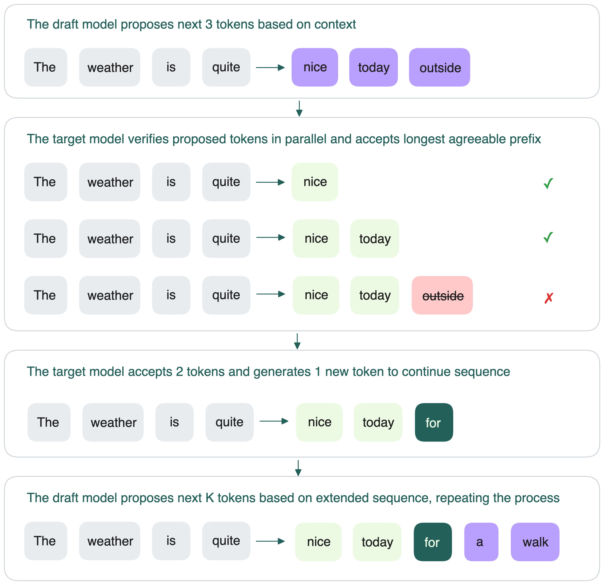

import LinkList from '@site/src/components/LinkList';

# Speculative decoding

Speculative decoding is an inference-time optimization that speeds up autoregressive generation by combining a fast “draft” model with the target model.

The core drivers behind this approach:

- Some tokens are easier to predict than others and can be handled by a smaller model.
- In LLM decoding, a sequential token-by-token generation process, the main bottleneck is memory bandwidth, not compute. Speculative decoding leverages spare compute capacity (due to underutilized parallelism in accelerators) to predict multiple tokens at once.

The roles of the two models:

- **Draft model**: A smaller, faster model (like a distilled version of the target model) proposes a draft sequence of tokens.
- **Target model**: The main model verifies the draft’s tokens and decides which to accept.

Here’s the step-by-step process:

1. The draft model predicts the next *K tokens* after the input sequence.
2. The target model then verifies these *K tokens* in parallel to see if it would also predict them.
3. The target model accepts the longest prefix of these *K tokens* that it agrees with.
4. If it accepts *h* tokens, it then generates the *(h+1)*-th token itself (so that generation remains on track).
5. The process repeats: the draft model proposes the next *K tokens* based on this new extended sequence.
    

    
Key benefits of speculative decoding:

- **Parallel verification**: Since verification doesn’t depend on previous verifications, it’s faster than generation (which is sequential).
- **High acceptance for easy tokens**: The draft model can often get the next few tokens correct, which speeds up generation.
- **Better use of hardware**: Because verification uses hardware resources that would otherwise be idle, overall throughput improves.

However, speculative decoding has its own costs. Because both the draft model and the target model need to be loaded into memory, it increases overall VRAM usage. This reduces the available memory for other tasks (e.g., batch processing), which can limit throughput, especially under high load or when serving large models.

<LinkList>
  ## Additional resources
  * [Looking back at speculative decoding](https://research.google/blog/looking-back-at-speculative-decoding/)
  * [Fast Inference from Transformers via Speculative Decoding](https://arxiv.org/abs/2211.17192)
  * [Accelerating Large Language Model Decoding with Speculative Sampling](https://arxiv.org/abs/2302.01318)
  * [Blockwise Parallel Decoding for Deep Autoregressive Models](https://arxiv.org/abs/1811.03115)
</LinkList>