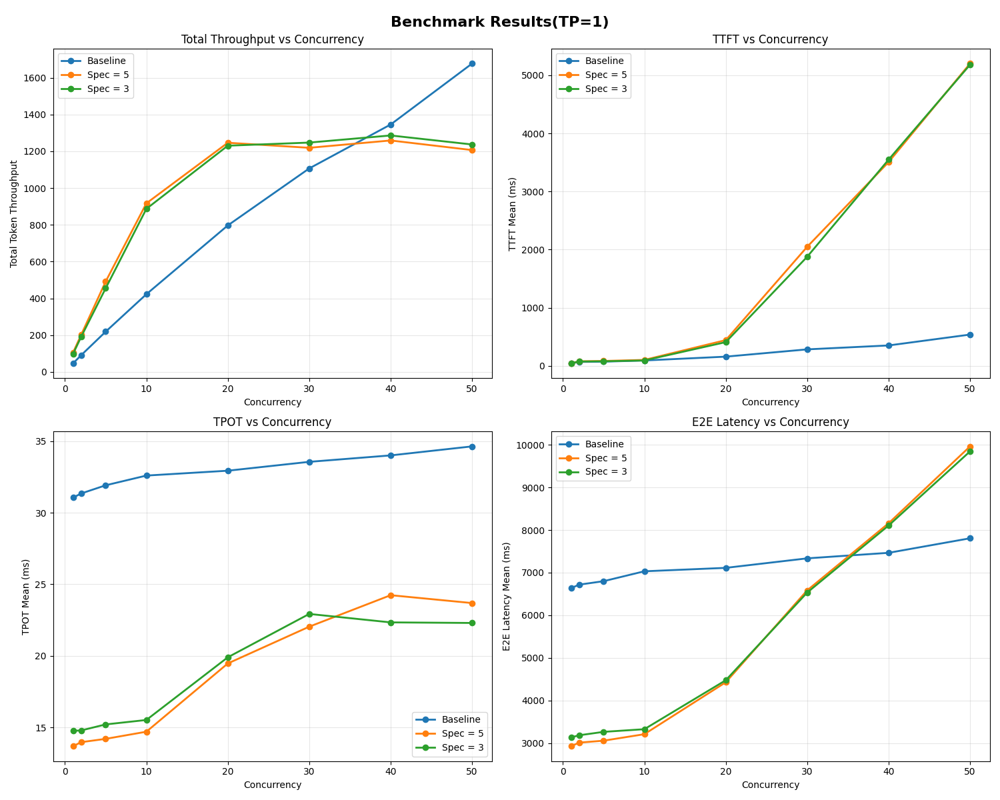
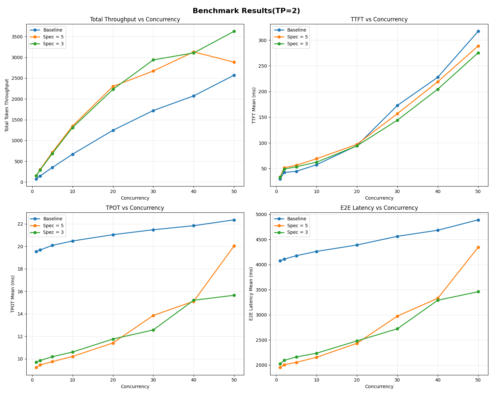

import LinkList from '@site/src/components/LinkList';

# Speculative decoding

Speculative decoding is an inference-time optimization that speeds up LLM token generation without reducing output quality. It works by pairing two models:

- **Draft model**: A smaller, fast model proposes several draft tokens ahead.
- **Target model**: A larger model verifies these proposed tokens in parallel and accepts those that match its own predictions.

This draft-then-verify pattern guarantees the final output matches exactly what the original target model would have produced on its own. Therefore, it does not sacrifice output quality.

With the right draft model, you can achieve **up to 3× faster LLM inference** using speculative decoding.

## Why speculative decoding

[Transformer-based LLMs generate text autoregressively](../llm-inference-basics/how-does-llm-inference-work#the-two-phases-of-llm-inference): one token at a time, each depending on the previous ones. Every new token requires a full forward pass, sampling, and then appending that token to the input before the next step begins.

This sequential process has two major issues:

- **High Inter-Token Latency (ITL)**: [The delay between tokens](./llm-inference-metrics) makes generation feel slow.
- **Poor GPU utilization**: The model can’t compute future tokens in advance even if the GPU is idle.

What if you could parallelize parts of the generation process, even if not all of it?

Inspired by speculative execution (operations are computed ahead of time and discarded if unnecessary), speculative decoding allows parts of token generation to run in parallel. When the target model verifies multiple draft tokens at once, it makes better use of GPU resources and reduces ITL. This is especially useful for latency-sensitive applications like chatbots and code completion tools.

This technique builds on [two key observations about LLM inference](https://research.google/blog/looking-back-at-speculative-decoding/):

1. **LLM inference is memory-bound**. GPUs have massive compute capacity but limited memory bandwidth. Much of their compute sits unused while waiting on memory access.
2. **Some tokens are easier to predict than others**. Many next tokens are obvious from context and can be proposed by a smaller model.

The draft-then-verify idea was first introduced by [Stern et al. (2018)](https://arxiv.org/abs/1811.03115), and later [extended by DeepMind](https://arxiv.org/pdf/2302.01318) into a statistically grounded method called **Speculative Sampling**. Speculative decoding is the application of speculative sampling to inference from autoregressive models, like transformers.

## How does speculative decoding work

At a high level, speculative decoding runs in a loop:

1. The draft model predicts the next *K tokens* after the input sequence.
2. The target model then verifies these *K tokens* in parallel to see if it would also predict them.
3. The target model accepts the longest prefix of these *K tokens* that it agrees with.
4. If it accepts *h* tokens, it then generates the *(h+1)*th token itself (so that generation remains on track).
5. The process repeats: the draft model proposes the next *K tokens* based on this new extended sequence.

## Understanding the performance of speculative decoding

Speculative decoding can accelerate LLM inference, but only when the draft and target models align well. Before enabling it in production, always benchmark performance under your workload. Frameworks like vLLM and SGLang provide built-in support for this inference optimization technique.

### Key metrics

When evaluating speculative decoding, three metrics matter most:

- **Acceptance rate (α)**: The probability of accepting draft tokens by the target model. This figure varies by several factors like decoding strategy (e.g., nucleus vs. random sampling) and application domain.
    
    A high α value means more tokens are accepted per round and you have fewer target model forward passes. This results in lower latency, higher throughput, and better GPU utilization. On the contrary, a low α indicates many tokens are rejected. This means you waste compute on drafting and verification. It also means reverting to sequential decoding more frequently.
    
- **Speculative token count (γ)**: The number of tokens the draft model proposes each step. It is configurable in most inference frameworks.
- **Acceptance length (τ)**: The average number of tokens accepted per round of decoding. According to the paper [Fast Inference from Transformers via Speculative Decoding](https://arxiv.org/pdf/2211.17192), you can calculate it with a theoretical formula:

    $$
    \tau = \frac{1 - \alpha^{\gamma+1}}{1 - \alpha}
    $$
    
### How acceptance rate impacts performance

In theory, the effectiveness of speculative decoding depends heavily on acceptance rate. To study this, the Bento team patched vLLM to simulate speculative decoding at different α and γ values (no draft model and the target model accepts tokens at preset rates).

Here are the key findings:

1. Higher α produces greater speedup.
2. Increasing γ helps only when τ is high; otherwise, performance may be negatively affected.
3. Latency drops and throughput rises almost linearly with α.
4. At α ≥ 0.6 and γ ≥ 5, speculative decoding achieved 2–3× speedups over baseline decoding.

In practice, however, the speedup was lower than expected. [Read this blog post](https://www.bentoml.com/blog/3x-faster-llm-inference-with-speculative-decoding) to see the full test results and analysis.

### How performance varies under different workloads

The Bento team also tested speculative decoding under different concurrency levels and tensor parallelism (TP) configurations.

<figure>

<figcaption>Llama-3.3-70B-Instruct served with vLLM on a single H100 GPU</figcaption>
</figure>

With TP = 1, the total throughput plateaued earlier (around 20–30 concurrent requests) compared to the baseline. This indicates that the coordination between the draft and target models might bring overhead at higher loads. Still, ITL (i.e. Time Per Output Token/TPOT) improved by roughly 2×.

<figure>

<figcaption>Llama-3.3-70B-Instruct served with vLLM on 2 H100 GPUs </figcaption>
</figure>

With TP = 2, the performance of speculative decoding improved, showing clear throughput gains over baseline. However, a higher speculative token count (γ = 5) saw larger latency spikes under heavy concurrency (40+ requests).

Overall, the results show that speculative decoding reduced ITL across different workloads. Adding parallelism (TP = 2) improves throughput, but you need to tune γ to avoid latency spikes at high load.

:::note
These results are from informal tests and for reference only. Performance varies depending on your model, hardware, workload, and framework choices. Always benchmark speculative decoding under your own conditions for production adoption.
:::

## Tips for using speculative decoding

Speculative decoding can deliver real gains, but only if you set it up carefully. The trick is knowing where it helps most and where it might backfire.

### Watch out for memory overhead

You need to load both the draft model and the target model into GPU memory. On a single GPU, it can quickly squeeze out space for other tasks (e.g., batch processing) and hurt performance under heavy load or with larger models.

For a multi-GPU setup (e.g., TP > 1), the story is different. Splitting models across multiple GPUs reduces the bottleneck. In the tests above, speculative decoding with γ = 3 or γ = 5 kept outperforming baseline even at 50 concurrent requests.

### Don’t ignore wasted compute

When the target model rejects too many draft tokens, your GPU still spends time generating and verifying them. The work doesn’t pay off and it defeats the point of speculative acceleration. It is also why acceptance rate matters so much.

### Get the draft model right

How closely your draft model’s distribution matches with the target model determines the acceptance rate. Out-of-the-box draft models may work fine in some cases, but they often struggle with domain-specific tasks or very long contexts.

If your workload has its own characteristics, you’ll likely get better results by [fine-tuning a draft model on your data](https://www.bentoml.com/blog/3x-faster-llm-inference-with-speculative-decoding). That way, it learns to mimic the target more closely, boosting acceptance rates and speedups. On the flip side, if you already see good acceptance, you can skip the training and still benefit.

<LinkList>
  ## Additional resources
  * [Get 3× Faster LLM Inference with Speculative Decoding Using the Right Draft Model](https://bentoml.com/llm/inference-optimization/speculative-decoding)
  * [Looking back at speculative decoding](https://research.google/blog/looking-back-at-speculative-decoding/)
  * [EAGLE: Speculative Sampling Requires Rethinking Feature Uncertainty](https://arxiv.org/pdf/2401.15077)
  * [Fast Inference from Transformers via Speculative Decoding](https://arxiv.org/abs/2211.17192)
  * [Accelerating Large Language Model Decoding with Speculative Sampling](https://arxiv.org/abs/2302.01318)
  * [Blockwise Parallel Decoding for Deep Autoregressive Models](https://arxiv.org/abs/1811.03115)
</LinkList>