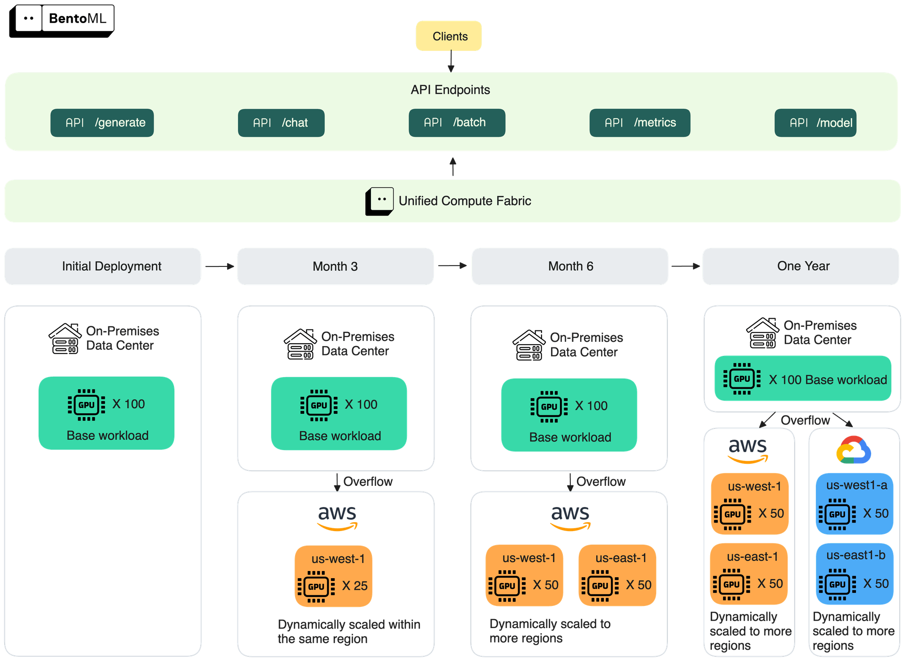

import LinkList from '@site/src/components/LinkList';
import Button from '@site/src/components/Button';

# On-prem LLM deployments

On-prem LLM deployment is a popular choice for teams that need tighter control over data, infrastructure, and cost. Unlike serverless inference APIs, you own the full stack, from GPUs and networking to scaling and monitoring. Enterprises typically adopt this pattern in private data centers or air-gapped environments, often with open-source models.

This kind of freedom brings advantages, but also serious engineering challenges.

## Why teams choose on-prem LLM deployments

AI teams usually turn to on-prem deployments for the following reasons:

- **Data security and compliance**: All inference runs inside your infrastructure. This reduces the risk of sensitive information leaving your environment. It also helps you meet strict regulatory requirements in industries such as healthcare, finance, and government.
- **Predictable costs**: After the initial hardware investment, ongoing inference costs may be lower than usage-based serverless APIs. However, you may need to apply certain inference optimization techniques like [KV cache offloading](../inference-optimization/kv-cache-offloading) and [prefix caching](../inference-optimization/prefix-caching) to stay within budget.
- **Performance control**: You can directly tune inference performance for your latency, throughput, and scaling goals without being limited by a provider’s SLA. This is extremely useful for high-volume or latency-sensitive applications.
- **Fewer external dependencies**: Since everything happens within your own network, you don’t have to rely on external providers. This allows you to enforce custom security measures such as authentication, access control, and auditing. This minimizes exposure to external threats.

In practice, on-prem LLM deployments make the most sense when:

- Your workloads are latency-sensitive and tied to strict SLAs.
- You have strict compliance needs that prevent vendor cloud options.
- Your organization can support the infrastructure and maintenance investment.

Otherwise, hybrid or cloud-based deployments may be a better choice with less overhead.

## Challenges of on-prem LLM deployments

On-prem solutions are flexible, but they also mean heavy responsibilities. They’re worth it only when the benefits clearly outweigh the overhead.

Here are some of the major challenges:

- **High upfront cost**: GPUs, networking gear, and storage require large capital investments, and hardware refresh cycles are expensive.
- **Operational complexity**: You’re responsible for autoscaling, upgrades, monitoring, and GPU procurement yourself.
- **Slower iteration**: Frontier models, inference frameworks, and optimization techniques have constantly sprung up. It can be hard to keep up when you have outdated hardware or slow buying processes. Additionally, compatibility is not always guaranteed. The more time engineers spend on infrastructure, the slower innovation and time-to-market become.
- **GPU availability**: Even with owned infrastructure, GPUs may not always be available, especially during usage peaks. To support scaling, you need to procure extra GPUs and deploy them, which can take weeks or months.
- **Talent requirements**: To efficiently operate a production-grade inference stack, engineers need specialized skills across DevOps, InferenceOps and MLOps. Such expertise is hard to hire and often more expensive than general engineering talent.

## On-prem vs. Cloud LLMs

No universal answer exists to whether on-prem is “better” than cloud. Each option fits different priorities.

- **On-prem LLMs** offer maximum control, stronger data privacy, and predictable costs once hardware is in place. They’re ideal for sensitive workloads or steady, high-volume traffic.
- **Cloud LLMs** provide flexibility, faster setup, and access to the latest hardware without capital investment. They’re a better fit for teams that need to experiment quickly, handle bursty workloads, or avoid managing infrastructure.

| Aspect | On-prem LLMs | Cloud LLMs |
| --- | --- | --- |
| **Data security and compliance** | Data stays inside your infrastructure; easier to meet strict compliance | Data processed by third-party providers; may require extra compliance work |
| **Cost model** | High upfront hardware investment; lower marginal costs for steady traffic | Pay-per-use; flexible for bursty or unpredictable workloads |
| **Performance control** | Full control over latency, throughput, and scaling behavior | Limited by provider SLAs and shared infrastructure |
| **Scalability** | Limited by purchased hardware; fast autoscaling for LLMs requires extra setups and configurations | Virtually unlimited, with on-demand GPU access; however, you may also need extra tuning to speed up cold starts for LLMs |
| **Maintenance and operations**  | Requires dedicated teams for infra, LLM-specific observability, and updates | Faster setup, but still require some infra management; [BYOC](./bring-your-own-cloud) offloads part of the burdens to service providers |
| **Flexibility** | Best for long-term, stable workloads | Best for rapid experimentation and dynamic workloads |

The decision usually depends on compliance requirements, traffic patterns, and how much operational complexity your team is willing to manage.

## Overflowing to the cloud: A hybrid approach

On-prem deployments give you control, but they can’t always handle bursty or unpredictable traffic. GPU procurement cycles are long, and over-provisioning to cover peak hours leads to wasted resources. That’s where a hybrid approach comes in.

In a hybrid setup, your on-prem cluster serves as the baseline for secure, predictable workloads. When demand exceeds local capacity, traffic can overflow to the cloud, where GPUs can be provisioned on demand. This lets you balance:

- **Control**: Keep sensitive or regulated workloads running in your own data center.
- **Availability**: Use cloud GPUs to handle spikes in usage without overbuilding on-prem hardware.
- **Cost**: Rely on lower-cost reserved GPUs for steady demand in your on-prem environment, and only pay for overflowed cloud GPUs during peaks.

Hybrid deployments give you flexibility without forcing you to compromise entirely on control, availability, or price. Many enterprises benefit from this pattern: security and compliance on-prem, elasticity in the cloud. See the blog post [How to Beat the GPU CAP Theorem in AI Inference](https://www.bentoml.com/blog/how-to-beat-the-gpu-cap-theorem-in-ai-inference) to learn more.

---

At Bento, we provide a unified compute fabric — a layer of orchestration and abstraction that allows enterprises to deploy and scale inference workloads across:

- On-prem GPU clusters
- Bring Your Own Cloud (including NeoCloud, multi-cloud and multi-region setups) environments

If your on-prem cluster runs out of capacity, Bento allows you to seamlessly overflow traffic to cloud GPUs. This ensures you always have enough compute power as you scale.

[<Button>Talk to us</Button>](https://l.bentoml.com/contact-us-llm-inference-handbook)

<LinkList>
  ## Additional resources
  * [Inference Platform: The Missing Layer in On-Prem LLM Deployments](https://www.bentoml.com/blog/inference-platform-the-missing-layer-in-on-prem-llm-deployments)
  * [How to Beat the GPU CAP Theorem in AI Inference](https://www.bentoml.com/blog/how-to-beat-the-gpu-cap-theorem-in-ai-inference)
  * [Should You Build or Buy Your Inference Platform?](https://www.bentoml.com/blog/should-you-build-or-buy-your-inference-platform)
</LinkList>