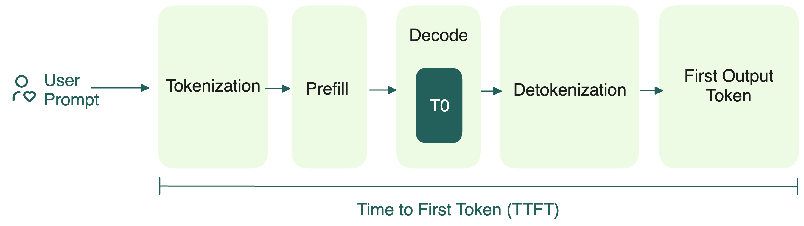
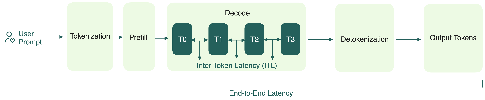

# How does LLM inference work?

During inference, an LLM generates text one token at a time, using its internal attention mechanisms and knowledge of previous context.

## What are tokens and tokenization?

A token is the smallest unit of language that LLMs use to process text. It can be a word, subword, or even a character, depending on the tokenizer. Each LLM has its own tokenizer, with different tokenization algorithms. Tokenization is the process of converting input text (like a sentence or paragraph) into tokens. The tokenized input is then converted into IDs, which are passed into the model during inference. 

Here is a tokenization example for the sentence `BentoML supports custom LLM inference.` using [GPT-4o’s tokenizer](https://platform.openai.com/tokenizer):

```bash
Tokens: "B", "ento", "ML", " supports", " custom", " L", "LM", " inference", "."

Token IDs: [33, 13969, 4123, 17203, 2602, 451, 19641, 91643, 13]
```

For output, LLMs generate new tokens autoregressively. Starting with an initial sequence of tokens, the model predicts the next token based on everything it has seen so far. This repeats until a stopping criterion is met.

## The two phases of LLM inference

For transformer-based models like GPT-4, the entire process breaks down into two phases: **prefill and decode**.

### Prefill

When a user sends a query, the LLM's tokenizer converts the prompt into a sequence of tokens. The prefill phase begins after tokenization:

1. These tokens (or token IDs) are embedded as numerical vectors that the LLM can understand.
2. The vectors pass through multiple transformer layers, each containing a self-attention mechanism. Here, query (Q), key (K), and value (V) vectors are computed for each token. These vectors determine how tokens attend to each other, capturing contextual meaning.
3. As the model processes the prompt, it builds a KV cache to store the key and value vectors for every token at every layer. It acts as an internal memory for faster lookups during decoding.

During the prefill stage, the entire prompt (namely, the whole sequence of input tokens) is already available before the LLM starts any actual computation. This means the LLM can process all tokens simultaneously through highly parallelized matrix operations, particularly in the attention computations.

As a result, the prefill stage is compute-bound and often saturates GPU utilization. The actual utilization depends on factors like sequence length, batch size, and hardware specifications.

A key metric to monitor for prefill is the Time to First Token (TTFT), which measures the latency from prompt submission to first token generation. More details will be covered in the [inference optimization](/inference-optimization) chapter.



### Decode

After prefill, the LLM enters the decode stage where it generates new tokens sequentially, one at a time.

For each new token, the model samples from a probability distribution generated based on the prompt and all previously generated tokens. This process is autoregressive, meaning tokens T₀ through Tₙ₋₁ are used to generate token Tₙ, then T₀ through Tₙ to generate Tₙ₊₁, and so on.


Each newly generated token is appended to the growing sequence. This autoregressive loop continues until:

- A maximum token limit is reached,
- A stop word is generated,
- Or a special end-of-sequence token (e.g., `<end>`) appears.

Finally, the sequence of generated tokens is decoded back into human-readable text.

Compared with prefill, decode is more memory-bound because it frequently reads from the growing KV cache. KV caching stores these key and value matrices in memory so that, during subsequent token generation, the LLM only needs to compute the keys and values for the new tokens rather than recomputing everything from scratch.

This KV caching mechanism significantly speeds up inference by avoiding redundant computation. However, it comes at the cost of increased memory consumption, since the cache grows with the length of the generated sequence.

A key metric to monitor for decode is Inter-token latency (ITL), the average time between the generation of consecutive tokens in a sequence. It is also known as Time Per Output Token (TPOT).



### Collocating prefill and decode

Traditional LLM serving systems typically run both the prefill and decode phases on the same hardware. However, this setup introduces several challenges.

One major issue is the interference between the prefill and decode phases, as they cannot run fully in parallel. In production, multiple requests can arrive at once, each with its own prefill and decode stages that overlap across different requests. However, only one phase can run at a time. When the GPU is occupied with compute-heavy prefill tasks, decode tasks must wait, increasing token latency, and vice versa. This makes it difficult to schedule resources for both phases.

The open-source community is actively working on different strategies to separate prefill and decode. For more information, see [prefill-decode disaggregation](/inference-optimization/prefill-decode-disaggregation).