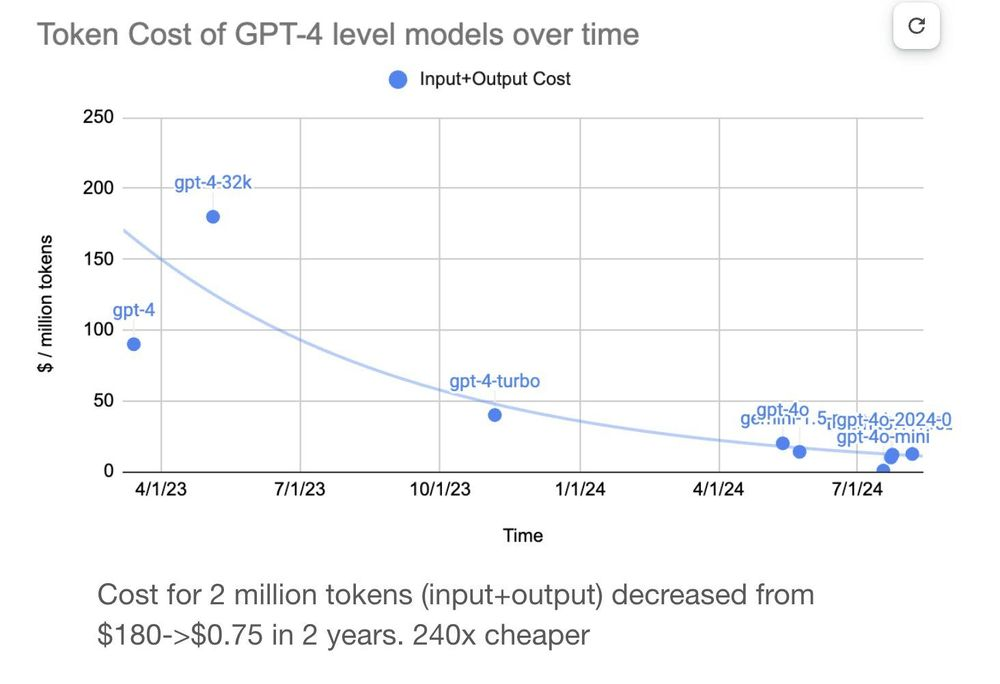

import LinkList from '@site/src/components/LinkList';
import Button from '@site/src/components/Button';

# Serverless vs. Self-hosted LLM inference

When building applications with LLMs, you typically have two main infrastructure choices: **serverless** (managed APIs) and **self-hosted** solutions. Each offers distinct advantages and trade-offs in terms of ease of use, customization, scalability, and compliance.

## Serverless LLM inference

Serverless inference services, provided by companies like OpenAI, Anthropic, and other hosted API providers, simplify application development significantly. They manage everything for you, letting you pay per use with no infrastructure overhead.

These services are powered not just by proprietary models like GPT-5 or Claude-Sonnet-4.5. Open-source models such as DeepSeek-R1 and Llama 4 are also available via serverless endpoints through platforms like Together AI and Fireworks.

Key advantages of serverless APIs include:

- **Ease of use**: You can get started quickly with minimal setup — just use an API key and a few lines of code. There is no need to manage hardware, software environments, or complex scaling logic.
- **Rapid prototyping**: It is perfect for testing ideas quickly, building demos, or internal tooling without infrastructure overhead.
- **Hardware abstraction**: Self-hosting LLMs at scale usually requires high-end GPUs (such as NVIDIA A100 or H100). Serverless APIs abstract these hardware complexities, allowing you to avoid GPU shortages, quota limits, and provisioning delays.

## Self-hosted LLM inference

Self-hosted LLM inference means deploying and managing your own LLM infrastructure, whether on cloud GPUs, private VPCs, or on-prem servers. It gives you full control over how models are deployed, optimized, and scaled, critical for enterprises to build long-term competitive advantage.

Key benefits of self-hosting include:

- **Data privacy and compliance**: LLMs are widely used in modern applications like RAG and AI agents. These systems often require frequent access to sensitive data (e.g., customer details, medical records, financial information). This is often not an acceptable option for organizations in regulated industries with compliance and privacy requirements. Self-hosting LLMs makes sure your data always stays within your secure environment.
- **Advanced customization and optimization**: With self-hosting, you can tailor your inference process to meet specific needs, such as:
    - Adjusting latency and throughput trade-offs precisely.
    - Implementing advanced optimizations like [prefill-decode disaggregation](../inference-optimization/prefill-decode-disaggregation), [prefix caching](../inference-optimization/prefix-caching), and [speculative decoding](../inference-optimization/speculative-decoding).
    - Optimizing for long contexts or [batch-processing](../inference-optimization/static-dynamic-continuous-batching) scenarios.
    - Enforcing structured decoding to ensure outputs follow strict schemas
    - [Fine-tuning models](../getting-started/llm-fine-tuning) using proprietary data to achieve competitive advantages.
- **Predictable performance and control**: When you self-host your LLMs, you have complete control over how your system behaves and performs. You’re not at the mercy of external API rate limits or sudden policy changes that might impact your application’s performance and availability.

## Comparison summary

Choosing between serverless and self-hosted LLM inference depends on your specific needs regarding ease of use, data privacy, performance optimization, and control.

| Item | Serverless APIs | Self-hosted inference |
| --- | --- | --- |
| **Ease of Use** | ✅ High (simple API calls) | ⚠️ Lower (requires LLM deployment and maintenance) |
| **Data Privacy & Compliance** | ⚠️ Limited | ✅ Full control |
| **Customization** | ⚠️ Limited | ✅ Full flexibility |
| **Cost at Scale** | ⚠️ Higher (usage-based, may rise significantly) | ✅ Potentially lower (predictable, optimized infrastructure) |
| **Hardware Management** | ✅ Abstracted away | ⚠️ Requires GPU setup & maintenance |

## How to think about costs

With serverless APIs, the cost per token is fixed, but total spend scales linearly with usage. That’s fine for early prototyping, but it becomes expensive fast in production.

With self-hosting, there’s more upfront work and infrastructure cost. However, your per-token cost will drop significantly as you scale, especially using inference optimization techniques like [KV cache offloading](../inference-optimization/kv-cache-offloading).

At different stages of your AI adoption, you may want to reevaluate your approach and weigh trade-offs between agility and control.

It's also worth noting that both serverless and self-hosted options are getting cheaper over time, thanks to:

- Ongoing API price cuts due to increased competition. This trend is evident from providers like OpenAI, which have significantly reduced token prices over time as shown in the image below.

  <figure>
    
    <figcaption>[Image source: davidtsong](https://x.com/eladgil/status/1827521805755806107)</figcaption>
  </figure>
    
- GPU hardware is becoming more efficient and affordable.
- Projects like vLLM and SGLang are enhancing the efficiency of model inferencing.
- Better-performing open-source models that require fewer resources with different optimization techniques.

For more information, see the blog post [Serverless vs. Dedicated LLM Deployments: A Cost-Benefit Analysis](https://www.bentoml.com/blog/serverless-vs-dedicated-llm-deployments).

## When to start serverless and when to take control

If you're just getting started with LLMs, serverless APIs are a great way to move fast. They make prototyping easy, lower the barrier to entry, and let you validate use cases without dealing with infrastructure.

But that simplicity comes with trade-offs. As your AI use cases grow, along with your need for performance, privacy, and differentiation, the limitations of serverless become hard to ignore.

Why? Every company building serious AI products needs more than just a good model. **The inference layer is what brings that model to life**. Relying solely on third-party APIs might get your app off the ground, but it won’t give you the long-term control or competitive edge you need. Compared with self-hosted inference, serverless model APIs make it hard to get fine-grained control over performance tuning and cost optimization. You are just calling the same API as everyone else. And that lack of customization hamstrings your ability to build lasting advantage:

1. **Compound AI systems** are how top teams win. [They chain multiple models and tools into rich, flexible workflows](https://www.bentoml.com/blog/a-guide-to-compound-ai-systems).
2. **Tailored inference stacks** let you architect for precise SLAs and cost targets across different workloads.
3. **Fine-tuned and custom models** give you domain-specific accuracy and IP protection that generic APIs can’t match.

At the end of the day, **inference quality is product quality**. If your AI is mission-critical, you’ll need infrastructure that’s fast, reliable, secure, and tailored to your goals.

That’s when it’s time to go beyond APIs and start owning your inference.

## What I have to solve if choosing self-hosting?

Self-hosting LLMs gives you full control and flexibility, but also comes with operational responsibilities beyond just spinning up GPU servers, such as:

- **DevOps time for setup and maintenance**: Setting up infrastructure, managing deployments, and keeping systems running smoothly.
- **Monitoring and alerting systems**: Implementing observability (including LLM-specific metrics like TTFT and TPS) to track performance, detect failures, and maintain SLAs.
- **Costs of data transfer and storage**: Handling large model files and managing cloud bandwidth or disk I/O costs.
- **Potential downtime and redundancy costs**: Ensuring high availability and planning for failover in case of hardware or service interruptions.
- **Slow cold starts**: This includes booting GPU instances, pulling LLM containers, and loading model weights into memory. Optimizing the startup time is critical for fast scaling to handle real-time or bursty workloads.

That said, you don’t have to build everything from scratch. An inference platform can help mitigate these costs and reduce the operational overhead, potentially making them more cost-effective in the long run.

---

At [Bento](https://www.bentoml.com/), we work to help enterprises self-host any open and custom LLMs with flexible distributed architecture and tailored inference optimization. With Bento Inference Platform, you can achieve up to 6x lower cost than serverless APIs.

[<Button>Talk to us</Button>](https://l.bentoml.com/contact-us-llm-inference-handbook)

## FAQs

### What does self-hosted AI mean?

Self-hosted AI means running and managing AI models on your own infrastructure (e.g., on-premises data centers, private cloud, or dedicated GPU servers).

With self-hosting, you keep full control over data privacy, performance tuning, and cost optimization. It’s useful for teams that need to:

- Deploy open-source models like DeepSeek-R1
- Customize models with specific optimization techniques
- Fine-tune models with proprietary data
- Meet internal compliance or data-sovereignty requirements

### Are proprietary models more powerful than open-source models?

Not always. It depends on your goals.

Proprietary models often lead in general-purpose reasoning, coding, and conversation quality because they’re trained on massive datasets and refined through advanced alignment techniques. They’re great if you want instant access to high performance without managing infrastructure.

Open-source models, such as Llama, Qwen, and DeepSeek, offer far more control, transparency, and flexibility. You can fine-tune them, deploy them anywhere, and optimize for latency and cost. The gap between open and proprietary models has narrowed quickly, especially for domain-specific workloads.

For example, when you fine-tune an open-source LLM with proprietary data in legal, medical or financial contexts, it can outperform proprietary models in that specific domain. This is exactly the kind of specialization many industries need today.

<LinkList>
  ## Additional resources
  * [Secure and Private DeepSeek Deployment with BentoML](https://www.bentoml.com/blog/secure-and-private-deepseek-deployment-with-bentoml)
  * [Serverless vs. Dedicated LLM Deployments: A Cost-Benefit Analysis](https://www.bentoml.com/blog/serverless-vs-dedicated-llm-deployments)
  * [Building RAG Systems with Open-Source and Custom AI Models](https://www.bentoml.com/blog/building-rag-with-open-source-and-custom-ai-models)
  * [ChatGPT Usage Limits: What They Are and How to Get Rid of Them](https://www.bentoml.com/blog/chatgpt-usage-limits-explained-and-how-to-remove-them)
</LinkList>